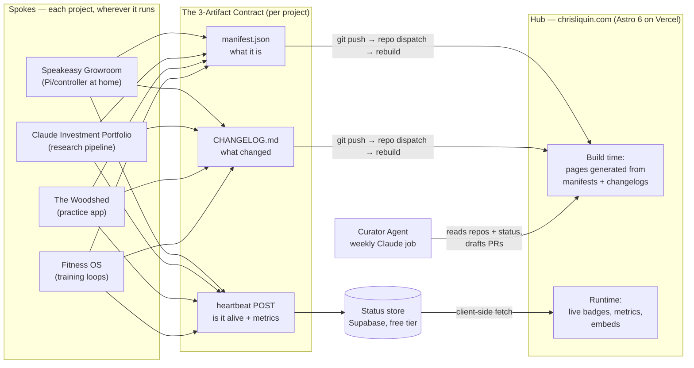
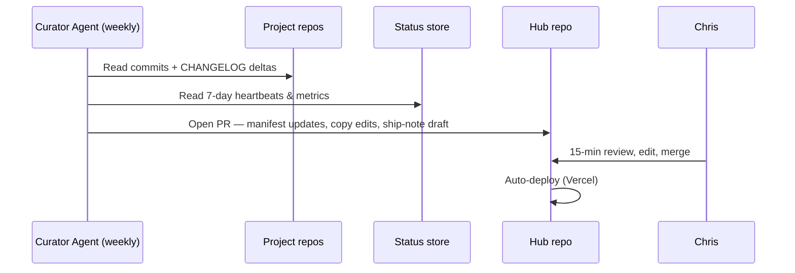

# Build Brief: The Lab — Personal AI Systems Portfolio

**Version:** 1.0 · **Date:** June 10, 2026 · **Owner:** Chris
**Status:** Blueprint approved decisions baked in. Nothing built yet.
**Intended use:** This file becomes `docs/BUILD_BRIEF.md` in the hub repo. Claude Code reads it as the founding document for every build session.

---

## 0. Executive Summary

A live portfolio site that is itself an AI system: a hub that catalogues, pitches, and *runs live demos of* every AI system Chris builds. Four launch projects (Speakeasy Growroom, Claude Investment Portfolio, The Woodshed, Fitness OS), each with its own tile → self-contained pitch page → working live tool.

The keystone architectural idea: **hub-and-spoke with a standard contract.** Every project ("spoke") publishes three artifacts — a manifest, a heartbeat, and a changelog. The hub ingests those automatically. That contract is what makes the site self-updating and makes adding project #5, #10, #20 a sub-30-minute task instead of a redesign.

- **Stack:** Astro 6 + Tailwind + MDX, GitHub, Vercel (free), Supabase (free) for live status. Built with Claude Code (first-timer onboarding included, §7.3).
- **Identity:** Personal domain (`chrisliquin.com` or similar) + a named "lab" brand inside it.
- **Growroom:** Full send, everywhere. One audience, one site, no toggle.
- **Cost:** ~$12–25/yr floor (domain only). Hosting, database, CI, analytics all $0 at this scale.
- **Effort:** ~30–40 build hours across 5 phases; shareable v1 after Phase 1 (~2 weekends).
- **First milestone:** domain live with a hello-world deploy by end of this week (Phase 0, ~2–3 hrs).

---

## 1. Product Definition

### 1.1 Positioning

> **"I don't use AI tools. I build AI systems that run my life — and here they are, running."**

The differentiator vs. every other "AI portfolio" on the internet: these aren't demos or weekend toys. They're production systems with uptime, loops, and real-life outcomes. The site's job is to make that undeniable in 90 seconds.

### 1.2 Audiences and what each must walk away with

| Audience | Takeaway | Design implication |
|---|---|---|
| Friends & family | "This is insanely cool. He built a robot weed farm and an AI investment committee." | Live demos front and center; personality in the copy; watchable things (Twitch, timelapses) |
| Employers / professional network | "This person designs multi-agent systems, ships them, and operates them. That's rare." | Architecture diagrams, patterns page, quantified outcomes, candid challenges sections, changelogs showing velocity |
| Chris | The canonical index of the system-of-systems. One place to see what's alive, dormant, or next. | Status honesty (real heartbeats), low-friction add/update workflow |

### 1.3 Jobs the site must do

1. **Catalogue** — tile grid of all systems with live status badges.
2. **Pitch** — each project page is a self-contained case study: problem → system → loops → AI leverage → challenges → payoff.
3. **Demo** — every project has a "Use it live" path (embed, launch link, or watchable feed).
4. **Stay true** — content and status update with minimal manual hub work (see update ladder, §3.4).
5. **Scale** — new projects onboard via template, not custom builds.

### 1.4 Success criteria (measurable)

- Add a new project end-to-end in **< 30 minutes**.
- Project iteration → site reflects it with **zero manual hub edits** (status/metrics) or **one merged PR** (narrative).
- A stranger understands "systems builder, ships constantly" within **90 seconds** on the homepage.
- ≥ 3 of 4 launch projects have a genuinely live element at launch.
- No page ever silently lies: anything stale is *labeled* stale automatically.

### 1.5 Non-goals for v1

No blog platform, no user accounts, no comments, no monetization, no mobile app, no CMS. The repo is the CMS. Resist all of these until v2+.

---

## 2. Decisions

### 2.1 Locked (from kickoff)

| # | Decision | Choice | Notes |
|---|---|---|---|
| D1 | Growroom audience handling | **Full send, everywhere** | One site for everyone. State the legal context in one matter-of-fact line on the project page, then never mention it again. Confidence reads better than hedging. |
| D2 | Identity | **Personal domain + lab brand** | Domain = your name (career SEO). The hub carries a named lab identity for creative latitude. |
| D3 | Build approach | **Code stack + Claude Code** | First Claude Code project — which itself becomes part of the portfolio story. Onboarding in §7.3. |

### 2.2 Open — decide during Phase 0

**D4. Lab brand name.** Candidates (gut-check availability before falling in love):

| Candidate | Rationale |
|---|---|
| **Compound Interests** | The thesis in two words: systems that compound, plus the investing wink. Tagline: "Systems that compound." Strong recommend. |
| **Loopwork** | Daily loops + West Loop + work. Clean, technical, ownable. |
| **Liquin Labs** | Alliterative, classic lab-brand move, ages well. |
| **The Woodshed** conflict note | Don't elevate a project name to the hub brand — keeps hierarchy clean. |

**D5. Domain(s).** Buy `chrisliquin.com` (~$10–15/yr at Cloudflare Registrar or Porkbun — both sell at/near cost). Optionally also grab a cheap `.systems` or `.dev` for the lab brand as a redirect. **Skip `.ai` for now:** registry price hikes put it at roughly $80–95/yr with a mandatory 2-year minimum (~$160–190 upfront) — vanity, not value, at this stage.

**D6. Investment project disclosure level.** Show *process* by default (pipeline, committee transcripts, structure); decide separately whether to show returns (% only, never $ amounts or positions). Content decision, not architecture — manifest supports either.

---

## 3. System Architecture

### 3.1 Shape: hub and spokes



### 3.2 The 3-Artifact Contract (the linkage spec)

Every project — current and future — must expose exactly three things. This is the entire integration surface. If a project satisfies the contract, the hub supports it with zero custom work.

| Artifact | What | Where | Powers |
|---|---|---|---|
| `manifest.json` | Identity, narrative, links, demo config, metrics definitions | Project repo root (or hub's `/projects/<slug>/` for code-less projects) | Tile, page scaffold, embeds, nav |
| Heartbeat | `POST {slug, status, metrics}` from the project's own automation | → Supabase `heartbeats` table | Live badges, metric counters, staleness detection |
| `CHANGELOG.md` | Human-readable ship log, newest first | Project repo root | "Recent activity" per project, monthly ship notes, curator input |

**Why push (not pull) for heartbeats:** the Growroom Pi sits behind home NAT — the hub can't poll it, and exposing your home network would be an opsec mistake anyway. Push-out telemetry works from anywhere, including Claude scheduled tasks (a task's last step is simply "POST the heartbeat"). One pattern covers every runtime.

### 3.3 Manifest schema v1 (the keystone — get this right)

```json
{
  "schema_version": "1.0",
  "slug": "speakeasy-growroom",
  "name": "Speakeasy Growroom",
  "tagline": "A fully automated grow operation with an AI agronomist on staff 24/7.",
  "status": "live",
  "maturity": 4,
  "started": "2025-11",
  "visibility": { "public": true },
  "stack": ["Raspberry Pi", "sensors/actuators", "Claude API", "Twitch"],
  "ai_roles": ["monitor", "anomaly-analyst", "daily-reporter"],
  "loops": [
    { "cadence": "hourly", "name": "Telemetry sweep (temp/RH/VPD/soil)", "automation": "full" },
    { "cadence": "daily",  "name": "Photo log + AI growth report",        "automation": "full" },
    { "cadence": "daily",  "name": "Anomaly check → alert if off-band",   "automation": "full" },
    { "cadence": "weekly", "name": "Nutrient/environment plan revision",  "automation": "human-approve" }
  ],
  "demo": { "type": "embed", "url": "https://player.twitch.tv/?channel=CHANNEL&parent=chrisliquin.com", "fallback": "timelapse.mp4" },
  "links": { "live": "...", "repo": "...", "page": "/projects/speakeasy-growroom" },
  "metrics": [
    { "label": "Days running",   "source": "heartbeat", "key": "uptime_days" },
    { "label": "Cycle day",      "source": "heartbeat", "key": "cycle_day" },
    { "label": "Alerts caught",  "source": "heartbeat", "key": "alerts_total" }
  ],
  "patterns": ["daily-loop", "heartbeat-monitoring", "anomaly-escalation", "human-approve-gate"]
}
```

Schema notes, field by field:

- **`status`** enum: `live | beta | concept | dormant | retired`. Set by you; *overridden to `dormant` automatically* if no heartbeat in 14 days (honesty as a feature — see §9.4).
- **`maturity`** 1–5: lets Fitness OS sit on the grid honestly at a 2 while Growroom flexes at 4. Tiles can render this as a progress treatment — "watch this one grow" is a feature, not an embarrassment.
- **`loops[].automation`** enum: `full | human-approve | manual`. This single field is quietly the most employer-impressive thing on the site — it shows you think in human-in-the-loop terms, not "automate everything" naivety.
- **`ai_roles`**: named agent roles (researcher, adversary, committee-chair, monitor, coach…). Recurs across projects → feeds the Patterns page.
- **`demo.type`** enum: `embed | launch | video | watch-only`. Every project must declare *something*; `fallback` is mandatory for embeds (Twitch goes offline; the page should degrade to a timelapse, not a black box).
- **`visibility`**: all-public today per D1; the flag costs nothing and preserves future optionality (e.g., a friends-only experiment).
- **`patterns`**: tags linking to the Patterns library (§4.3).

Validate manifests against a JSON Schema file in CI — a typo'd manifest should fail the build, not render a broken tile.

### 3.4 The update ladder (answers "how does it stay current?")

Four levels, built in order. Each level reduces manual work; the site functions at every rung.

| Level | Mechanism | What updates | Your effort |
|---|---|---|---|
| **L1 — Git is the CMS** | Edit MDX/manifest → push → Vercel auto-deploys | Everything | Minutes, manual |
| **L2 — CI linkage** | Project repo push → GitHub Action validates manifest → `repository_dispatch` → hub rebuilds | Manifests, changelogs flow in automatically | Zero (after one-time Action setup per repo) |
| **L3 — Live runtime data** | Projects POST heartbeats → Supabase → hub fetches client-side | Status badges, metrics, "last active" — no rebuild needed | Zero |
| **L4 — Curator Agent** | Weekly scheduled Claude job reads commits, changelogs, and 7 days of heartbeats → drafts a PR: manifest deltas, copy refreshes, ship-note draft | Narrative content | 15-min Sunday review + merge |



**Guardrail:** metrics and status publish without approval (they're facts); narrative *never* auto-publishes (it's your voice). The curator drafts; you merge.

### 3.5 Live demo layer

| Demo type | Used by | Implementation |
|---|---|---|
| `embed` | Growroom | Twitch iframe (requires `parent=` domain param, HTTPS). Fallback: latest timelapse. |
| `launch` | The Woodshed | Button → the hosted app itself. If app has auth, ship a public **demo mode** (read-only sample data or guest sandbox). |
| `watch-only` | Investment Portfolio | Read-only dashboard + a *committee transcript gallery* (rendered bull/bear/chair debates — flagship content, see §5.2). |
| `video` | Fitness OS (v1) | 60–90s screen capture until a live surface exists. |

**Hard rule:** no secrets client-side, ever. Anything embedded must be public-read-only by construction. Supabase is read via anon key with row-level security (read-only on `heartbeats`); writes use service keys that live only in project runtimes.

---

## 4. Information Architecture & Page Specs

### 4.1 Sitemap

```
/                      Home (mission control)
/projects/<slug>       Project case study × N
/patterns              Reusable AI patterns library
/about                 Systems-builder bio + resume + contact
/changelog             Cross-project ship log (auto-aggregated)
```

### 4.2 Home — "Mission Control"

- **Hero:** positioning line + a **live status strip** — one status light per system, last-activity ticker, pulled from heartbeats. This is the money shot: the instant, visceral proof that these systems are *alive right now*. Nobody else's portfolio has a heartbeat.
- **Tile grid:** one tile per project — name, tagline, status badge, maturity indicator, 1–2 headline metrics, hover → micro-preview. Click → case study.
- **Patterns teaser:** "The same 8 patterns power everything here →"
- **About strip + contact.** Footer: GitHub, LinkedIn, the lab brand mark.

### 4.3 Project page template (the "self-contained pitch")

Fixed section order — consistency across projects *is* the brand:

1. **Hero** — name, status badge, tagline, headline metrics, primary CTA ("Watch it live" / "Use it" / "Read the committee's last debate").
2. **The Pitch** — Problem → System → Payoff. Three short paragraphs. Why this matters in real life, not just technically.
3. **The Loops** — table straight from `manifest.loops`: cadence × what happens × automation level. This section *is* the "I build systems" proof.
4. **AI Architecture** — which models, in which named roles, where the human-approval gates sit. Diagram-adjacent prose.
5. **The Flowchart** — interactive diagram of the full system (Mermaid in v1; upgrade path to React Flow for pan/zoom/click-to-explain in v2).
6. **Challenges & Lessons** — candid: what broke, what you'd redo. Counterintuitively the highest-credibility section on the page for senior readers. Never skip it.
7. **Live** — the demo embed/launch per §3.5.
8. **Changelog & Metrics** — auto-fed from the contract artifacts. Shows velocity without claiming it.
9. **Roadmap** — 3–5 bullets. Signals the system is going somewhere.

### 4.4 /patterns — the thought-leadership flex

One page distilling the reusable patterns across all projects, each with a one-paragraph explanation and links to the projects using it:

Adversarial Review · Committee Synthesis · Researcher→Critic→Editor chains · The Daily Loop (sense→decide→act→log→report) · Heartbeat Monitoring & Staleness Honesty · Human-Approve Gates · Manifest-Driven Content · The Curator Agent.

This page reframes you from "guy with cool projects" to "person with a transferable systems methodology." For employer readers it's the highest-value page on the site. Later: open-source the templates (§11.4).

### 4.5 Design direction

Per your taste: dark, industrial-luxe, editorial typography, restrained motion. The motif writes itself — **status lights**: grow-room LEDs, server racks, channel strips. Premium without flash; let live data be the decoration. Auto-generated OG images per project (project name + status + a headline metric) so every shared link looks deliberate. One accent color per project, consistent across tile/page/diagrams.

---

## 5. Launch Content: The Four Project Capsules

Per-project content plan + what each needs to satisfy the contract. **Spoke-readiness is the real dependency** — the hub is straightforward; the work is giving each project a public surface, a heartbeat, and a changelog.

### 5.1 Speakeasy Growroom — readiness: HIGH (closest to done)

- **Pitch angle:** "An AI agronomist on staff 24/7." Sensors → controller → actuators, with Claude as monitor, anomaly analyst, and daily reporter. Emphasize the *escalation design*: routine handled silently, anomalies alert, plan changes require human sign-off.
- **Live element:** Twitch embed (exists — biggest head start of the four) + a telemetry panel from heartbeat metrics.
- **Flowchart nodes:** sensors (temp/RH/VPD/soil) → controller → actuators (lights/fans/pump) → hourly telemetry → status store; daily photo + telemetry → Claude report → Twitch overlay; out-of-band reading → anomaly agent → alert; weekly plan revision → human approve.
- **To do for launch:** heartbeat POST from the controller (small), manifest, changelog, written case study.
- **Sensitivities:** one-line legal context on the page (per D1), and opsec — no street-level location info, push-only telemetry, nothing inbound to the home network.

### 5.2 Claude Investment Portfolio — readiness: MEDIUM

- **Pitch angle:** "A one-person fund with a full AI investment committee." The pipeline is the star: theme evaluation → deep research → **adversarial red-team review** → committee synthesis → portfolio structuring → continuous monitoring. This is the project that most impresses professional readers — it demonstrates multi-agent orchestration *and* judgment about where humans stay in the loop.
- **Flagship content: the Committee Transcript Gallery.** Publish lightly-redacted bull/bear/chair debates. People will actually read AI arguing with itself — it's the most shareable artifact on the entire site, and it already exists as a byproduct of the system. Near-zero build cost.
- **Live element:** watch-only — process dashboard (cycle stage, reports generated, last committee date) + transcript gallery. Returns: per D6, % only if at all; never positions or dollar amounts.
- **To do:** redaction pass + transcript renderer, heartbeat from pipeline runs, disclaimer ("personal research system, not investment advice").
- **Flowchart nodes:** theme intake → research agents (parallel) → red team → committee → structurer → monitor loop → weekly cycle.

### 5.3 The Woodshed — readiness: MEDIUM

- **Pitch angle:** "Deliberate practice, systematized." AI as curriculum designer, session generator, and accountability layer for jazz trumpet. The universal hook: everyone has a skill they've failed to practice consistently; here's what it looks like to solve that with a system.
- **Live element:** the app itself in demo mode (public read-only sample student, or guest sandbox). If the app currently runs locally/in Claude sessions, hosting it (Vercel, same account) is the gating task. Bonus: latest practice-session metrics, streak counter, even a recent audio clip.
- **Metrics:** streak, sessions logged, total hours, pieces/concepts mastered.
- **To do:** public hosting + demo mode (the gating item), heartbeat on session completion, manifest, changelog.

### 5.4 Fitness OS — readiness: LOW (and that's the content angle)

- **Pitch angle:** publish it at `maturity: 2, status: beta` and frame the page as **"watch a system get built."** The roadmap and changelog *are* the demo. This is honest, differentiating, and turns immaturity into a reason to revisit the site.
- **Standardization blueprint** (also the page's roadmap): ingest (workouts, body metrics, sleep — Apple Health/Whoop export) → weekly programming loop (AI drafts next week from last week's actuals, human-approve) → monthly "performance review" memo → quarterly program redesign.
- **Live element v1:** short video + a simple metrics panel once the first ingest loop exists.
- **To do:** define the v1 loop, manifest, first changelog entry. Deliberately small.

---

## 6. Repos & Conventions

### 6.1 Repo topology

```
github.com/<you>/
  portfolio-hub/            ← the site
    src/                    (Astro app: pages, components, layouts)
    projects/<slug>/        (manifest.json + case-study MDX + diagram source per project)
    schema/manifest.schema.json
    docs/BUILD_BRIEF.md     ← this file
    CLAUDE.md               ← conventions for every Claude Code session
  speakeasy-growroom/       ← per-project repos, each with manifest.json + CHANGELOG.md
  investment-committee/
  woodshed/
  fitness-os/
```

- **Hub holds the canonical case-study prose**; project repos hold canonical manifest + changelog (synced to hub via L2 dispatch). Code-less projects can live entirely in the hub's `projects/` folder — the contract, not the repo, is what matters.
- **`CLAUDE.md` in every repo** (Claude Code reads it automatically each session): stack conventions, manifest schema location, "validate manifests before commit," design tokens, voice/tone notes for copy. This is how quality stays consistent across sessions — write it once in Phase 0, it pays forever. In the hub's CLAUDE.md, include: "Read docs/BUILD_BRIEF.md before structural changes."
- **Public vs. private:** hub repo public (it's part of the showcase). Project repos public where clean; private is fine — the site links what it links.
- **Secrets:** `.env` locally, Vercel env vars in prod, service keys only in project runtimes, anon read-only key in the client. Add gitleaks or GitHub secret scanning from day one — *before* the first commit, not after the first leak.

---

## 7. Tooling, Accounts & Costs — the acquisition list

### 7.1 Buy / sign up / download

| # | Item | Purpose | Cost (verified June 2026) |
|---|---|---|---|
| 1 | Domain — `chrisliquin.com` (Cloudflare Registrar or Porkbun) | Canonical home | ~$10–15/yr |
| 2 | (Optional) `.systems`/`.dev` for lab brand | Vanity redirect | ~$10–25/yr |
| 3 | ~~`.ai` domain~~ | Skip for now | ~$80–95/yr, 2-yr minimum after 2026 price hikes |
| 4 | GitHub account + repos | Source of truth, CI | $0 |
| 5 | **Node.js 22 LTS** + pnpm | Astro 6 requires Node 22+ | $0 |
| 6 | **Claude Code** — native installer at claude.com/download | The builder | Included in your existing Claude subscription |
| 7 | Astro 6 + Tailwind + MDX | Site framework | $0 |
| 8 | Vercel (Hobby) | Hosting + auto-deploy from GitHub | $0 — 100GB transfer, 1M edge requests/mo; personal/non-commercial use, which this is |
| 9 | Supabase (free tier) | Heartbeat/status store | $0 |
| 10 | Vercel Analytics (basic) | Traffic | $0 (Plausible later if you want better, ~$9+/mo) |
| 11 | UptimeRobot (free) | External "is the site up" check | $0 |
| 12 | Screen recorder (CleanShot/QuickTime) | Demo videos, timelapses | $0–29 once |

**Total run-rate floor: ~$12–25/yr.** The entire stack rides free tiers comfortably at portfolio scale.

### 7.2 Why this stack (one paragraph each, then stop relitigating)

**Astro over Next.js:** the site is 90% content with islands of interactivity (status strip, embeds, diagrams) — exactly Astro's lane; it ships ~zero JS by default, and Astro 6 (March 2026) is current and stable. **Vercel over Cloudflare Pages:** tightest GitHub auto-deploy loop and zero-config previews on every PR; Cloudflare is the fallback if limits ever bite (they won't at this scale). **Supabase over rolling your own:** a heartbeat table with RLS read-only anon access is a 20-minute setup and replaces an entire API layer. **Mermaid before React Flow:** flowcharts in v1 are text-in-the-repo (curator-editable, diffable); upgrade to interactive React Flow per-project in v2 where the wow justifies it.

### 7.3 Claude Code onboarding (first time — budget one evening)

1. **Install:** download the native installer from claude.com/download (no Node needed for the CLI itself; you still need Node 22+ for Astro). Sign in with your existing Claude account.
2. **Core loop:** `cd portfolio-hub && claude` → describe what you want → it reads the repo, proposes diffs → you review/approve → it edits → you commit. You stay the editor; it does the typing.
3. **Session 1 script (verbatim, after Phase 0 scaffold):** "Read docs/BUILD_BRIEF.md. Scaffold the Astro 6 site per §6.1: manifest schema, tile grid reading from projects/*/manifest.json, and the project page template per §4.3. Stub all four launch projects with placeholder manifests."
4. **Habits that compound:** keep `CLAUDE.md` current (it's persistent memory across sessions); work in small reviewed commits; ask it to write the GitHub Actions and Supabase setup too — CI/SQL is where it saves you the most as a first-timer.
5. **Meta note:** you're learning the tool by building the portfolio that showcases the tool. Document the experience — it feeds the Project Zero page (§11.4).

---

## 8. Build Plan — phases, dependencies, definitions of done

### 8.1 Dependency map (what blocks what)

```
Domain ──→ DNS ──→ Vercel deploy          (independent of all content)
Manifest schema ──→ tiles & project pages (blocks ALL page work — do first in P1)
Supabase table ──→ badges ──→ per-project heartbeat senders
Project public surfaces (Woodshed hosting, transcript renderer) ──→ "Use it live"
CHANGELOG files ──→ L2 dispatch ──→ L4 curator    (curator is last; it needs everything else's output to read)
```

Critical path to "shareable": schema → four manifests → tile grid → four case-study pages. Everything live/automated layers on after and *enhances* rather than blocks.

### 8.2 Phases

| Phase | Scope | Hours | Definition of Done |
|---|---|---|---|
| **P0 — Decisions & rails** (this week) | Pick lab name (D4), buy domain, GitHub + Vercel + Supabase accounts, install Node 22/pnpm/Claude Code, scaffold Astro, first deploy, write CLAUDE.md, commit this brief | 2–3 | Hello-world live on your domain |
| **P1 — Hub MVP** (1–2 weekends) | Manifest schema + validation, tile grid, project page template, four case studies written, Mermaid flowcharts, design pass, about page | 10–14 | Shareable v1 — send to a friend AND a colleague; both takeaways land |
| **P2 — Live layer** (1 weekend) | Supabase heartbeats table + RLS, status strip + badges, Growroom heartbeat + Twitch embed w/ fallback, one more project reporting | 6–8 | Homepage shows real-time status of ≥2 systems |
| **P3 — Automation** (1 weekend, then ongoing) | Per-repo manifest validation + repo-dispatch Actions, changelog ingestion, Curator Agent v1 (scheduled Claude job → weekly PR) | 6–10 | Push to a project repo → site updates with zero manual hub edits; first curator PR reviewed & merged |
| **P4 — Polish & launch** (1 weekend) | OG image generation, analytics, copy edit, demo-mode hardening, Woodshed hosted, transcript gallery, LinkedIn launch post | 5–7 | Posted publicly; OG cards look deliberate everywhere |

**Total: ~30–40 hours.** Claude Code compresses calendar time more than it compresses your review attention — plan accordingly.

**Sequencing rule:** ship P1 before touching P2. The single biggest risk in this project is building the self-updating machinery before there's a site worth updating (see R6).

---

## 9. Operating Model — how it stays alive

### 9.1 Cadences

| Cadence | Ritual | Time |
|---|---|---|
| Weekly (Sun) | Review & merge curator PR; glance at status strip for anything dormant | 15 min |
| Monthly | "Ship note" — curator drafts a cross-project changelog roundup; you polish → /changelog + optional LinkedIn post | 30 min |
| Quarterly | Portfolio review: promote/retire projects, update maturity scores, pick next build from backlog (§11), small design refresh | 1–2 hrs |

### 9.2 Add-a-project runbook (target: < 30 min)

1. Copy `projects/_template/` → fill manifest (10 min)
2. Write the case study MDX from the standard section prompts (15 min with Claude Code)
3. Add heartbeat POST as the last step of the project's own automation (5 min)
4. Create `CHANGELOG.md` with entry #1 → push. Done — tile, page, badges, curator coverage all automatic.

### 9.3 Curator Agent v1 spec

- **Trigger:** weekly schedule (Claude scheduled task, or GitHub Action calling the Claude API — start with whichever you set up fastest; the Action version is more portable long-term).
- **Reads:** each repo's commits + CHANGELOG delta since last run; 7 days of heartbeats/metrics.
- **Writes:** one PR to the hub — manifest deltas, stale-copy flags ("page says 'just shipped X' — that was 3 months ago"), ship-note draft.
- **Never:** auto-merges narrative, touches secrets, edits this brief.

### 9.4 Staleness defense (anti-rot)

Every project page renders "last active" from heartbeats. No heartbeat in 14 days → badge auto-flips to `dormant` — no shame, no lie. A portfolio that *admits* dormancy is more credible than one that pretends; rot is what kills every other personal site, and this design makes rot visible instead of silent.

---

## 10. Risks & Mitigations

| # | Risk | Mitigation |
|---|---|---|
| R1 | Stale content quietly lies | Heartbeat-driven badges + curator stale-copy flags (§9.4) |
| R2 | Dead embeds (Twitch offline) | Mandatory `demo.fallback` per manifest; build fails without one |
| R3 | Secrets leakage | Push-only telemetry, anon read-only client keys, secret scanning pre-commit, public-repo hygiene review in P4 |
| R4 | Cannabis optics with some employers | Accepted per D1 (full send). Mitigate in *framing*: engineering-forward copy, one-line legal context, zero stoner aesthetic — the page reads "control systems," not "head shop" |
| R5 | Financial content misread as advice | Disclaimer + process-over-positions default (D6) |
| R6 | Over-engineering the meta-system before the site exists | Phase gates: P1 ships before P2 starts. The brief says it; hold yourself to it |
| R7 | Personal data exposure (health/fitness) | Trends and adherence %, not raw body data; redaction pass in P4 |
| R8 | Demo-mode auth holes in Woodshed | Read-only sample account, no real user data in sandbox |
| R9 | New projects bypass the contract → site fragments | Runbook discipline (§9.2): if it doesn't have the 3 artifacts, it doesn't get a tile |

---

## 11. Expansion Backlog — what to build next

Grouped; each rated for life-value (does it actually help you) and demo-value (does it make the portfolio cooler). Effort: S < 1 weekend · M 1–2 · L 3+.

### 11.1 Extensions of existing systems (fast wins)

| Idea | What | Effort | Why |
|---|---|---|---|
| **Committee Transcript Gallery** | Publish redacted bull/bear/chair debates from the investing pipeline | **S** | Highest demo-value-per-hour on this list; content already exists as system exhaust |
| **Grow timelapse + CV growth tracking** | Daily photos → auto-timelapse per cycle + growth-curve charting; AI flags growth-rate anomalies | S–M | Visceral, shareable, feeds the Twitch story |
| **Tone Analyzer (Woodshed)** | Record long tones → AI scores pitch/tone stability over time → improvement charts | M | Audio + longitudinal data — a genuinely rare demo; "AI hears me getting better" |
| **Meal-Prep Loop (Fitness OS)** | Sunday: macro targets + preferences → menu, grocery list, cook plan | S | High life-value; natural Fitness OS milestone |

### 11.2 New flagship systems

| Idea | What | Effort | Why |
|---|---|---|---|
| **Morning Chief of Staff** | Daily 6:30am brief: calendar, weather, markets, grow status, practice queue, top-3 priorities — every system reports to one agent | M | The connective tissue. Unlocks the best homepage line on the site: *"My systems file a report every morning."* Build this next. |
| **CFO Agent** | Monthly close: spend ingest, subscription audit, net-worth trend → a board-style memo to yourself | M | Directly serves the rebuild-finances priority; publish the *pattern* and a redacted memo, never the numbers |
| **Decision Engine** | Your adversarial-committee pattern generalized to any big decision (apartment, offer, major purchase) | M | Employer catnip: a bespoke pipeline abstracted into a reusable product. Strategy-consulting brain, productized |
| **Market Radar** | Weekly AI × retail/CPG trend brief: agents scan, synthesize, you edit, publish | M | Dual-use: portfolio piece *and* Circana-relevant thought leadership *and* a LinkedIn content engine. Highest career leverage on this list |
| **Personal CRM** | Relationship cadence system: birthdays, follow-ups, dinner rotation, "you haven't seen X in 6 weeks" | S–M | Quietly excellent life-value; demos as "AI for being a better friend" |

### 11.3 Creative / fun (the personality layer)

| Idea | What | Effort | Why |
|---|---|---|---|
| **Speakeasy Cocktail Lab** | Photo your bar → inventory → guest-aware menu cards, party mode | S–M | Everyone's favorite demo at an actual party; extends the Speakeasy brand world |
| **Chicago Concierge** | Thursday brief: jazz sets, restaurants, events scored to taste; agent drafts the plan | M | Locally flavored, instantly relatable |
| **Practice Content Engine** | Auto-clip Woodshed sessions → captioned shorts → posting cadence + analytics loop | M | Feeds the content-creation ambition; the *pipeline* is the portfolio piece, posting is optional |
| **The Annual Report** | Quarterly "shareholder letter" on your life, auto-drafted from every system's data; AI board (bull/bear/operator personas) reviews your quarter | M | The signature meta-artifact. Funny, audacious, deeply on-brand for "Compound Interests" — and nobody else has one |

### 11.4 Meta (nearly free, high signal)

- **Project Zero** — the portfolio itself, listed as a project with its own manifest, loops (curator, heartbeats), flowchart, and changelog. The site eating its own dog food; costs ~an hour, lands every time. Include at launch.
- **Patterns Library, open-sourced** — templates repo (manifest schema, curator prompt, heartbeat snippets) others can fork. Moves you from "has projects" to "has a methodology people use."
- **Build-in-public lab notes** — the curator already drafts ship notes; lightly edit → occasional posts. v2, only if it stays cheap.

### 11.5 Prioritization (demo-value × life-value)

1. **Committee Transcript Gallery** — in P4 of the main build; it's content, not a system.
2. **Project Zero** — at launch; ~free.
3. **Morning Chief of Staff** — first *new* system post-launch; ties everything together and upgrades the homepage narrative.
4. **Market Radar** — second; career compounding while the portfolio compounds.
5. Then by season: Cocktail Lab before hosting a party, Annual Report at quarter-end, Tone Analyzer when Woodshed v2 itches.

### 11.6 Showcase strategy — signaling competent *and* creative

- **Live beats video beats screenshot.** Push every project up that ladder one rung per quarter.
- **Quantify on every page.** "Caught 14 anomalies," "31 committee cycles," "142-day streak." Numbers read as operator; adjectives read as enthusiast.
- **Candor as credibility.** The Challenges sections and visible dormant badges do more for senior readers than any polish. Confident people show their scars.
- **Velocity made visible.** Changelogs and ship notes prove iteration without you ever saying "I move fast."
- **The patterns page is the promotion case.** Projects show you can build; patterns show you can *abstract* — that's the difference between a tinkerer and a systems thinker.
- **One LinkedIn post per project,** staggered weekly post-launch, each linking its case study. The site is the asset; the posts are distribution.

---

## 12. Next Actions (this week, ~2–3 hours)

1. Pick the lab name (D4) and check domain availability — 15 min
2. Buy `chrisliquin.com` at Cloudflare Registrar or Porkbun — 10 min
3. Create GitHub account/repos; sign up Vercel + Supabase — 15 min
4. Install Node 22 LTS, pnpm, Claude Code (native installer, claude.com/download) — 20 min
5. Scaffold Astro 6, connect repo to Vercel, point DNS, deploy hello-world — 45 min
6. Commit this file as `docs/BUILD_BRIEF.md`, write `CLAUDE.md`, run the Session 1 script from §7.3 — 30 min

Phase 1 starts next weekend.

---

*Pricing/version sources (June 2026): [Vercel Hobby plan](https://vercel.com/docs/plans/hobby) · [Vercel free tier limits](https://deploywise.dev/blog/vercel-free-tier-limits-2026) · [Astro 6 release](https://astro.build/blog/astro-6/) · [.ai price increase](https://domainnamewire.com/2026/02/02/ai-domain-name-prices-going-up-20/) · [.ai registrar pricing](https://tld-list.com/tld/ai) · [Claude Code setup](https://code.claude.com/docs/en/setup)*
