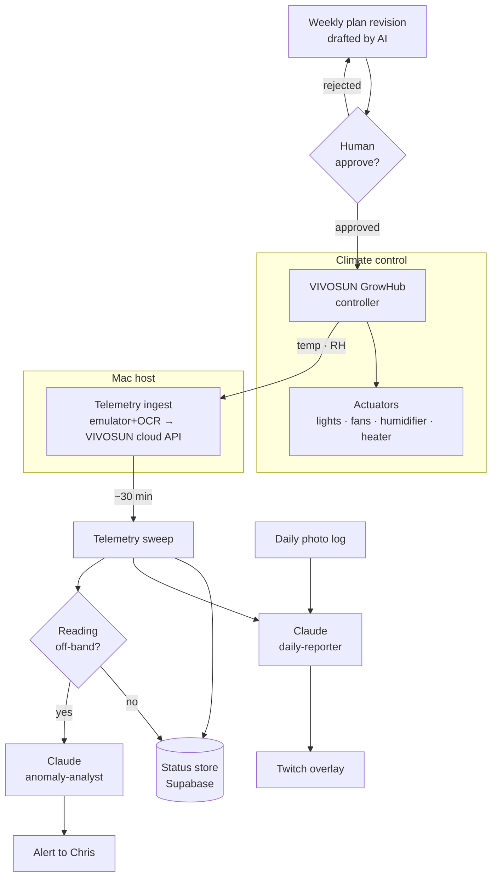

# Speakeasy Growroom

> **Status:** `LIVE` · Maturity **4 / 5**
> **A fully automated grow operation with an AI agronomist on staff 24/7.**

| Metric | Value |
|---|---|
| Days running | `{{uptime_days}}` |
| Cycle day | `{{cycle_day}}` (Jack Herer grow) |
| Anomalies caught | `{{alerts_total}}` |

**▶ Watch it live** — the room is streaming right now. *(Falls back to the latest cycle timelapse when the stream is offline.)*

*Legal context: operated for personal use, fully compliant with applicable state law.* That's the only line this page spends on it — the interesting part is the control system.

---

## The Pitch

**Problem.** A grow is a continuous control problem disguised as a hobby. Temperature and humidity drift every hour; a single bad night — a stuck fan, a missed watering, a heat spike while you're asleep — can set a cycle back weeks. Doing it well by hand means being on-call 24/7 for ~10 weeks straight. Nobody actually sustains that, which is why most home grows are a story of good intentions and one ruined harvest.

**System.** The climate control itself runs on a **VIVOSUN GrowHub controller** — a commercial grow controller that drives lights, fans, humidifier, and heater to setpoints. The interesting layer sits *on top* of it: a **Mac host** reads the room's telemetry, narrates it, and streams it. Today telemetry is pulled by running the VIVOSUN app in an Android emulator, screen-capturing it, and OCR'ing the readings every 30 minutes — a pipeline being retired in favor of a **direct pull from the VIVOSUN GrowHub cloud API** (see Challenges). On top of that telemetry layer sits an AI agronomist: Claude monitors temperature and humidity, writes a plain-language daily growth report against the photo log, and escalates anything off-band. The design principle is **graduated autonomy** — routine is handled silently, anomalies raise an alert, and anything that changes the *plan* (a nutrient bump, a light-schedule shift) waits for human sign-off before it touches the room.

**Payoff.** The grow runs whether or not I'm paying attention, and I find out about problems while they're still cheap to fix instead of at harvest. The room narrates itself: every day there's a report explaining what changed and why, and the whole thing streams live so the claim "this is a production system, not a demo" is verifiable in real time, not asserted in a paragraph.

---

## The Loops

| Cadence | What happens | Automation |
|---|---|---|
| ~30 min | Telemetry sweep — temperature + humidity read from the VIVOSUN feed and pushed to the status store | **full** |
| Daily | Photo log + AI growth report (telemetry + image → written daily report → stream overlay) | **full** |
| Daily | Anomaly check — readings compared against target bands; alert fires if off-band | **full** |
| Weekly | Nutrient / environment plan revision drafted by the AI agronomist | **human-approve** |

The automation column is the point. Sensing, reporting, and anomaly detection run with no human in the loop. The one thing the system is *not* allowed to do on its own is change the plan — that gate is deliberate.

---

## AI Architecture

Three named AI roles sit on top of a deterministic control layer:

- **Monitor.** Watches the telemetry stream (temperature + humidity). Its job is cheap and constant: is every reading inside its target band? It holds no opinions; it just establishes ground truth and hands anomalies up the chain.
- **Anomaly-analyst.** Wakes only when the monitor flags an out-of-band reading. It reasons about *what kind* of problem this is — transient (a door left open) vs. structural (a failing fan) — and decides whether to alert. This is where judgment lives, so it gets the harder model call.
- **Daily-reporter.** Once per day, takes the photo log plus 24 hours of telemetry and writes the growth report that lands on the Twitch overlay and in the changelog.

**Where the human gate sits.** The VIVOSUN controller's climate loop and all three AI roles run autonomously. The single human-approve gate is the **weekly plan revision**: the system can *recommend* a nutrient or environment change, but a human approves it before it's applied. Sensing and reporting are facts and ship freely; plan changes are decisions and wait for me. (Real-world example of why: the **week-3 nutrient start decision** for the current Jack Herer grow, ~day 15, is exactly the kind of call that gets drafted by the system and signed off by a human.)

---

## The Flowchart

---

## Challenges & Lessons

- **Capture pipeline was the fragile part, not the grow.** The hardest reliability problems weren't agronomy — they were the boring plumbing: the dashboard server, the **VIVOSUN-app emulator + OCR** job that scrapes the readings, and the OBS scene feeding Twitch. The emulator path is the #1 source of silent failures — the emulator crashes, contends with OBS for CPU, drifts out of OCR calibration, and needs a launchd watchdog babysitting it. Lesson learned the expensive way: an "automated grow" is only as live as its flakiest capture job. The fix in progress is to **retire the emulator + OCR entirely** and pull telemetry straight from the **VIVOSUN GrowHub cloud API over HTTPS** — which also kills the watchdog and the OBS-for-data contention, leaving "VIVOSUN cloud is down" as the only remaining failure mode. The migration runs alongside the move to a new Mac host. *[metric: capture uptime before/after migration — pull from heartbeat once the new host is steady.]*
- **Resisting the urge to let the AI drive.** The tempting design is "let Claude adjust nutrients automatically." I deliberately didn't. A wrong autonomous nutrient change is irreversible within a cycle, so the plan-revision gate stays human. The lesson generalizes: automate sensing and reporting fully; gate anything irreversible. That single distinction is most of what "human-in-the-loop" actually means in practice.
- **Pull from the cloud, not the house.** Rather than expose the home network to let a hub poll the grow directly, telemetry comes from the **VIVOSUN cloud** — the Mac host pulls readings out of VIVOSUN's API and the public site never has an inbound path to the house. The same pattern works from anywhere.
- **What I'd redo.** Build the heartbeat emitter *first*, before the dashboard. Early on, "is it alive?" was answered by looking at the stream — fine until the stream itself was the thing that broke.

---

## Live

**What you see:** a live Twitch embed of the room — plants under lights, the current cycle in progress — with a telemetry panel beside it reading the latest heartbeat metrics (days running, cycle day, current temperature + humidity, anomalies caught to date). The most recent AI daily report is shown as an overlay/caption so a visitor can read, in plain language, what the room did today.

**What you do:** mostly watch. The stream is the demo. When Twitch is offline, the panel degrades gracefully to the latest cycle **timelapse** rather than going dark — so the page is never a black box. *(Dual-cam capture is in progress, which will add a second angle.)*

*Opsec note baked into the build: no street-level or location-identifying detail appears in the stream, overlay, or copy.*

---

## Changelog & Metrics

**Recent activity** *(newest first — stub, grounded in current status; final entries come from `CHANGELOG.md`)*

- **2026-06-13** — Daily grow-check + live Twitch dashboard running; dual-cam capture in progress.
- **2026-06** — Dashboard server migrating to new Mac host; old-Mac emulator + OCR jobs being retired (reliability win).
- **2025-11** — Grow operation brought online; first automated cycle begins.

**Metrics this page surfaces** *(definitions)*

- `uptime_days` — consecutive days the system has been reporting heartbeats. Source: heartbeat.
- `cycle_day` — current day within the active grow cycle. Source: heartbeat.
- `alerts_total` — count of anomalies the system has caught and escalated. Source: heartbeat.

---

## Roadmap

- **Heartbeat from the Mac host** — the small remaining task that lights up the live telemetry panel and the homepage status badge. *(Supabase heartbeat is planned, not yet emitting.)*
- **Finish the capture migration** — complete the move to the new Mac host, switch telemetry to the VIVOSUN cloud API, and confirm OBS baseline; retire the legacy emulator/OCR jobs and watchdog for good.
- **Dual-cam capture** — second camera angle into the stream and timelapse.
- **CV growth tracking** — daily photos → auto-timelapse per cycle + a growth-rate curve, with the anomaly-analyst flagging growth-rate stalls (not just environment readings).
- **Cocktail Lab spinoff** — extend the Speakeasy brand world: photograph the bar → inventory → guest-aware menu cards. *(Backlog; party-driven.)*
