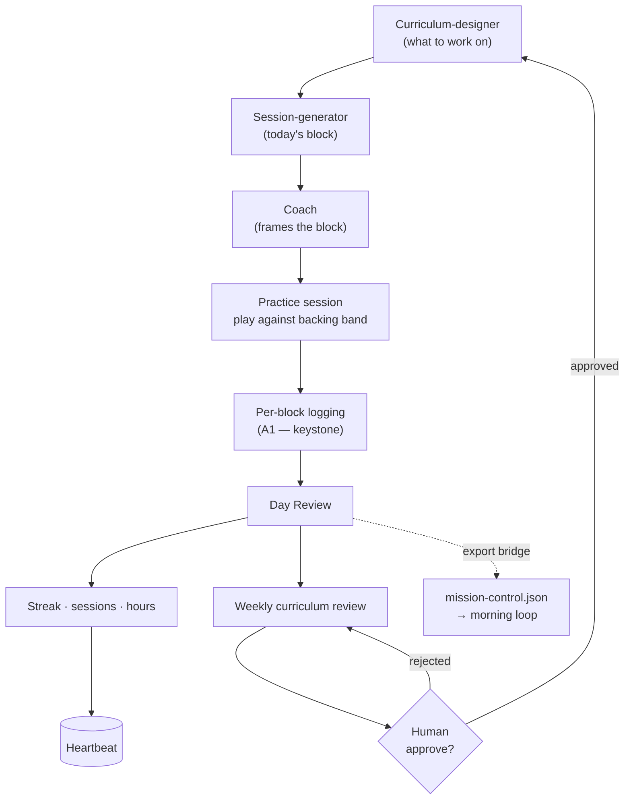

# The Woodshed

> **Status:** `BETA` · Maturity **3 / 5**
> **Deliberate practice, systematized — an AI curriculum, coach, and accountability layer for jazz trumpet.**

| Metric | Value |
|---|---|
| Current streak | `{{streak_days}}` days |
| Sessions logged | `{{sessions_total}}` |
| Total hours | `{{hours_total}}` |

**▶ Use it live** — open the app in demo mode and walk through a real practice session.

---

## The Pitch

**Problem.** Everyone has a skill they've meant to get good at and never practiced consistently. For me it's jazz trumpet. The hard part was never the horn — it's the *system around* the horn: knowing what to work on today, structuring a session so it's deliberate instead of noodling, and actually showing up tomorrow. Motivation is not a strategy. Most people quit not because they can't improve but because nothing tells them what to do next and nothing notices when they stop.

**System.** The Woodshed is that missing system. An AI **curriculum-designer** decides what to work on and why; a **session-generator** turns that into a concrete practice block — exercises, tunes, the backing band to play against; a **coach** layer frames each block; and an **accountability** layer logs what actually happened and reviews the day. The keystone currently being built is **per-block logging plus a Day Review** — the piece that captures real practice data and feeds the daily loop, so the system learns from what I actually did, not what it planned.

**Payoff.** Practice becomes a loop that runs itself: show up, the session is already designed, play, log, get a review, and tomorrow's session is shaped by today's. The streak counter and session log make consistency visible — which, for a thing everyone fails to do consistently, *is* the whole game. It's a working answer to "what does it look like to solve the practice problem with a system instead of willpower?"

---

## The Loops

| Cadence | What happens | Automation |
|---|---|---|
| Daily | Session generator builds today's practice block (exercises, tunes, backing band) | **full** |
| Daily | Per-block logging + Day Review — what was practiced, how it went *(in build — A1, the keystone)* | **full** |
| Daily | "Today's 6" — the day's priority items surfaced and grouped | **full** |
| Weekly | Curriculum review — adjust focus from logged practice data | **human-approve** |
| Per session | Streak / hours / sessions updated → heartbeat *(emitter planned)* | **full** |

---

## AI Architecture

Four named roles, layered from "what to work on" down to "did you actually do it":

- **Curriculum-designer.** The long-horizon planner. Decides what skills and concepts to develop and in what order — the difference between practicing *something* and practicing the *right* something.
- **Session-generator.** Turns today's curriculum target into a concrete, playable session: long tones, technical work, real licks over a ii-V-I backing loop, tunes to solo on with the band. This is where the abstract plan becomes "here's your next 45 minutes."
- **Coach.** Frames each block — the intent behind it, what "good" sounds like — so a session is deliberate practice, not just reps.
- **Accountability.** Logs what actually happened (per-block), runs the Day Review, and keeps the streak honest. This layer is the one currently being built out, because without real logged actuals the curriculum-designer is planning blind.

**Where the human gate sits.** Session generation, logging, and the Day Review run automatically — the system can plan and record on its own. The **weekly curriculum review** is human-approve: the system proposes a shift in focus from the logged data, and I decide whether to take it. Day-to-day is automated; the direction of the training stays a human call.

---

## The Flowchart

---

## Challenges & Lessons

- **The logging layer is the keystone, and it was the part I under-built first.** It's tempting to build the fun parts — the session generator, the MIDI/Web-Audio backing band, the ABCJS notation rendering — and treat logging as plumbing. That's backwards. Without **per-block logging and a Day Review** (the A1 work in progress), the curriculum-designer has no actuals to learn from and the whole "the system adapts to you" promise is hollow. The current rebuild puts logging first on purpose. Lesson: in any practice/habit system, the data-capture loop is the foundation, not a feature.
- **Generated content has to be musically real.** A session generator that emits plausible-looking but musically wrong exercises is worse than useless — it teaches bad habits. The biggest content lift in the rebuild is **real licks and a real ii-V-I backing loop**, research-backed, not synthesized filler. The current backing band runs on a **MIDI / Web-Audio synth** and still sounds like basic MIDI — upgrading that engine is a known item, separate from the musical-correctness work. Correctness over volume.
- **One dependency was quietly blocking the best feature.** The export bridge that feeds the morning loop (`mission-control.json` → morning task) is **blocked on the logging work** — you can't export practice data you aren't capturing yet. A clean reminder that feature dependencies are real: sequencing the keystone first unblocks several things downstream at once.
- **What I'd redo.** Ship the logging + Day Review loop before the "solo with the band" polish. The flashy feature is the reason to come back; the logging loop is the reason the system *works*. I built toward the flash first and am now reordering.

---

## Live

**What you see:** the actual app, running in **demo mode** — a read-only sample student with realistic practice history. A visitor can open a generated practice session, see the curriculum target and the coach's framing, view the notation with a playable backing band, and browse the sample log: streak counter, sessions logged, hours, pieces and concepts worked. Optionally a recent practice audio clip.

**What you do:** click through a real session end to end — see what the system told the student to practice today, why, and what got logged. The demo is the read-only sample account; no real user data is exposed in the sandbox.

*Honest note for launch: the app is mid-rebuild (logging keystone in progress), so demo mode reflects the **current** surface, not the roadmap. The gating task before this goes live is **public hosting + demo mode** — until then this section ships as a short walkthrough video.*

---

## Changelog & Metrics

**Recent activity** *(newest first — stub, grounded in current status; final entries come from `CHANGELOG.md`)*

- **2026-06-13** — Fix plan + rebuild spec written (`WOODSHED-FIX-PLAN`, `WOODSHED-REBUILD-SPEC`).
- **2026-06** — A1 in build: per-block logging + Day Review (the keystone that fuels the morning loop).
- **2026-06** — Next up: "solo with the band" rebuild (A5) and real licks + ii-V-I backing loop (A4).
- **2025-09** — Woodshed practice app online; first sessions logged.

**Metrics this page surfaces** *(definitions)*

- `streak_days` — consecutive days with a logged practice session. Source: heartbeat.
- `sessions_total` — total practice sessions logged. Source: heartbeat.
- `hours_total` — cumulative practice hours. Source: heartbeat.
- *(Pieces / concepts mastered — surface once per-block logging is live.)*

---

## Roadmap

- **Public hosting + demo mode** — the gating task that makes "Use it live" real (read-only sample student, no real data — R8).
- **A1: per-block logging + Day Review** — the keystone; everything adaptive depends on it.
- **A5: "solo with the band" rebuild** — highest daily value; the reason to come back.
- **A4: real licks + ii-V-I backing loop** — biggest content lift, research-backed musical correctness.
- **Tone Analyzer** — record long tones → AI scores pitch/tone stability over time → improvement charts. ("AI hears me getting better" — a genuinely rare longitudinal-audio demo.)
- **Export bridge → morning loop** — once logging lands, feed practice data into the Morning Chief of Staff brief.
